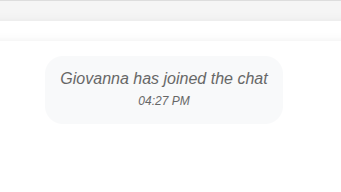
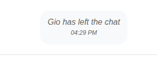

# Chat Application

A real-time chat application with message persistence built using Node.js, Express, Socket.IO, and MongoDB.

## Features

- Real-time messaging with Socket.IO
- User presence (join/leave notifications)
- Message history persistence with MongoDB
- Fallback to file-based storage if MongoDB is unavailable
- Responsive design for desktop and mobile
- Simple and intuitive UI

## Screenshots

### Joining USer


### Chat Interface


### Left User


## Requirements

- Node.js (v14+)
- MongoDB (optional, app will use file-based storage if MongoDB is not available)

## Installation

1. Clone this repository:
   ```
   git clone <repository-url>
   cd chat-app
   ```

2. Install dependencies:
   ```
   npm install
   ```

3. Configure MongoDB (optional):
   - Make sure MongoDB is running on your machine
   - The app uses `mongodb://localhost:27017/chatapp` by default
   - If MongoDB is not available, the app will automatically use file-based storage

4. Start the server:
   ```
   npm start
   ```

5. Open your browser and navigate to:
   ```
   http://localhost:3000
   ```

## Development

For development with auto-restart on code changes:
```
npm run dev
```

Note: You'll need to install nodemon globally or as a dev dependency for the dev script to work:
```
npm install -g nodemon
```
or
```
npm install --save-dev nodemon
```

## How It Works

### Backend

- **Express**: Handles HTTP requests and serves static files
- **Socket.IO**: Manages real-time bidirectional event-based communication
- **MongoDB/Mongoose**: Stores chat messages in a MongoDB database
- **File-based Storage**: Fallback storage option if MongoDB is unavailable

### Frontend

- **HTML/CSS/JavaScript**: Simple frontend implementation
- **Socket.IO Client**: Connects to the server for real-time updates
- **Responsive Design**: Works on both desktop and mobile devices

## API Endpoints

- `GET /api/messages`: Retrieves the latest 100 chat messages

## Socket.IO Events

- `user_join`: When a user joins the chat
- `user_joined`: Sent to the client after joining successfully
- `active_users`: Updates the list of active users
- `send_message`: Client sends a new message
- `message`: Server broadcasts a message to all clients

## License

ISC 
